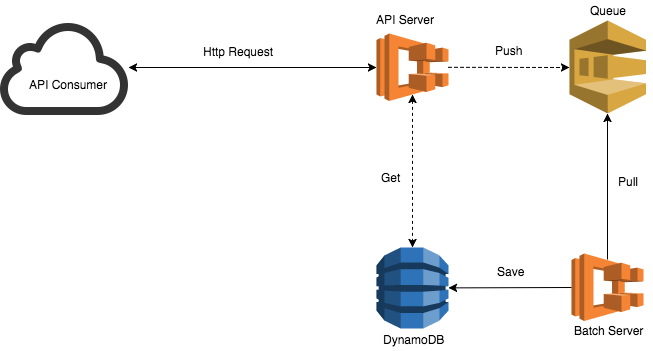
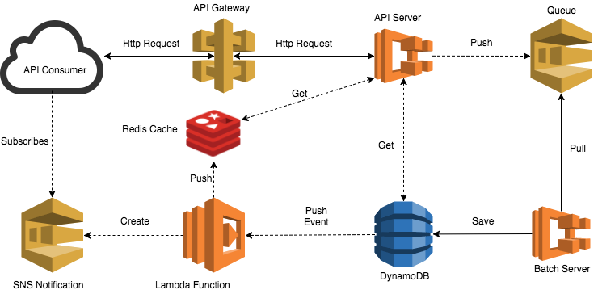

# A Reactive Web Crawler

A Recursive Web crawler built in Java 8 with reactive streams, async queues and AWS DynamoDB.

## Problem
Crawling Web sites is an intensive task, and it comes with some challenges.

* How to crawl sub-pages when the website hierarchy is unknown?
* How to crawl websites efficiently?
* How to manage long-running HTTP requests?

## Diagram v1


## Implementation
* A version the [Depth-first search (DFS)](https://en.wikipedia.org/wiki/Depth-first_search) algorithm has been implemented. The search starts from the seed URL and traverses the sub-pages until the pre-defined depth limit is reached, or there are no more sub-pages.
* Using [netty.io](https://netty.io/) client with non-blocking calls and multiple threads.
* If the Seed URL exists:
  * Reply with existing record.
* If the Seed URL doesn't exist:
  * Create a record in a NEW state and reply to the API Consumer.
  * Send the request to the queue.
  * The batch server picks up the request and updates the record to IN_PROGRESS.
  * Once the task is completed save the record to the database. If successful set status to COMPLETED, otherwise FAILED.

### Limitations
- [TODO] The API Consumer is not notified when the crawling process is completed [Version 2](#diagram-v2-todo).
- [TODO] In-Memory cache to reduce response time. [Version 2](#diagram-v2-todo).
- [TODO] API Security mechanisms: Request logging, throttling and auditing [Version 2](#diagram-v2-todo).
- [TODO] Automated CI/CD Pipelines [Version 2](#diagram-v2-todo).
- [TODO] UI [Version 2](#diagram-v2-todo).
- [TODO] Add contract, component, integration and performance tests [Version 2](#diagram-v2-todo).
- Crawling depth must be defined.
- Only nodes prefixed with the Seed URL will be recursed.
> **Example:**
>
> seedUrl = http://first-example.com
>
> nodes = "http://first-example.com/about", "http://another-example.com"
>
> Only URLs prefixed with 'http://first-example.com' will be crawled recursively.

## Getting Started

These instructions will get you a copy of the project up and running on your **local machine** for development and testing purposes.

### Prerequisites

```
Java8
Gradle 4.1 (Or just use provided Gradle wrapper)
To Run the application in a Integrated Environment you must configure AWS DynamoDB and SQS endpoints at `src/main/resources/application.properties`.

```
## Build

```
gradle clean build
```

## Running Unit tests

```
gradle test
```

## Built With

* [Gradle 4.1](https://docs.gradle.org/4.1/userguide/userguide.html) - Dependency Management
* [Spring Boot 2](https://docs.spring.io/spring-boot/docs/2.0.0.M4/reference/htmlsingle/) - Web framework
	* [Spring 5 Web Reactive](https://docs.spring.io/spring-framework/docs/5.0.0.M4/spring-framework-reference/htmlsingle/) - Spring Support for Web Reactive
	* [Reactor](https://projectreactor.io/) - Reactive Core
	* [Netty io]( https://netty.io/) - Web Client
	* [Spring JMS](https://docs.spring.io/spring/docs/current/spring-framework-reference/html/jms.html) - Java Messaging Service
* [AWS SDK](https://aws.amazon.com/sdk-for-java/) - AWS SDK for Java
* [AWS SQS](https://aws.amazon.com/sqs/) - Messaging Provider
* [AWS DynamoDB](https://aws.amazon.com/documentation/dynamodb/) - NoSQL Database
* [Jsoup](https://jsoup.org/) - Java HTML Parser
* [Wiremocks](http://wiremock.org/) - Mock URLs for testing

## Diagram v2 (TODO)


* Add Redis In-Memory cache.
* Add AWS API Gateway (API Management).
* Add Lambda function to be triggered on DynamoDB events.
* Add SNS Notification.
* Infrastructure as a code using AWS Cloud Formation.
* Pipeline as a Code using Jenkis.
* Angular 4 UI.

## Author

* **[Hafid F Sousa](https://github.com/hafidsousa)**

## License

This project is licensed under the [Apache License 2.0](LICENSE).
